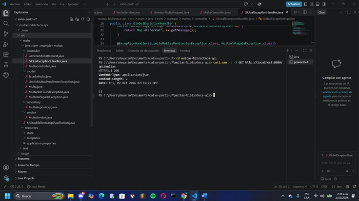
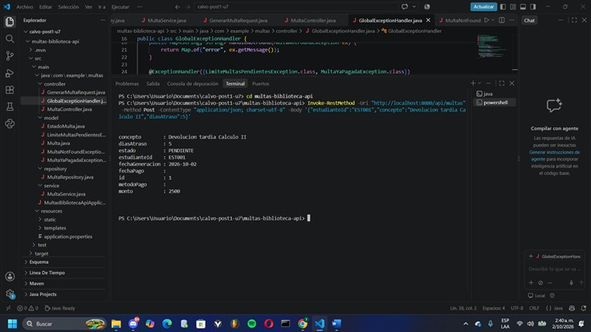
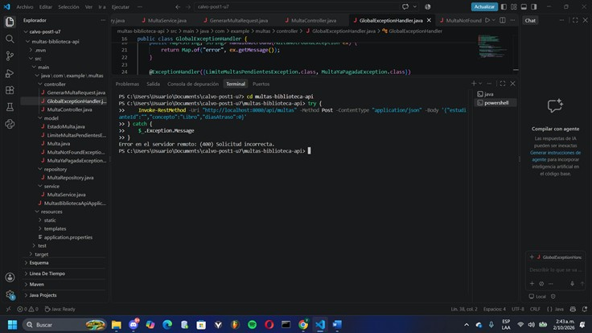
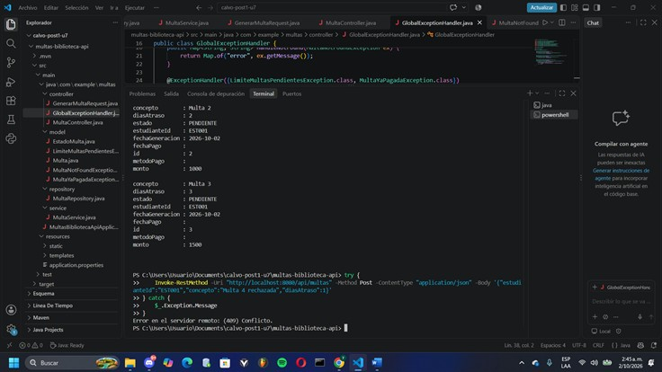
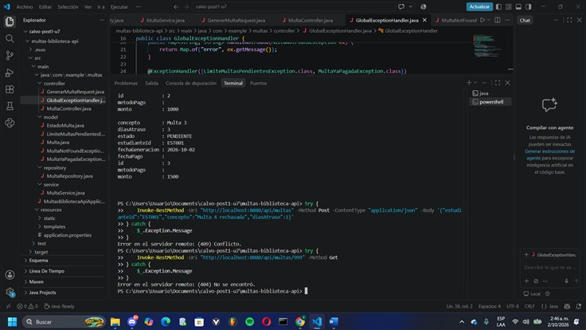
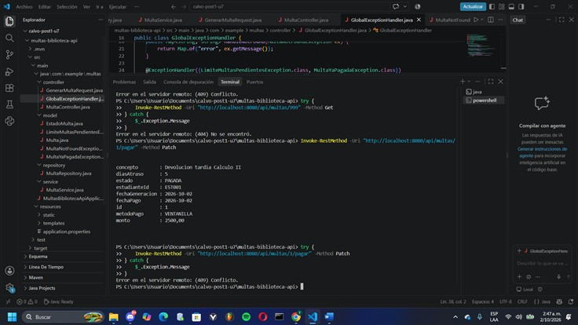
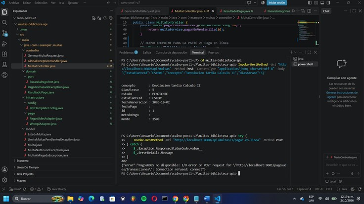
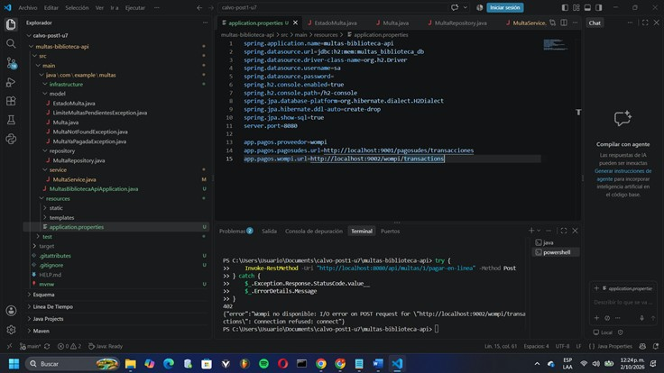
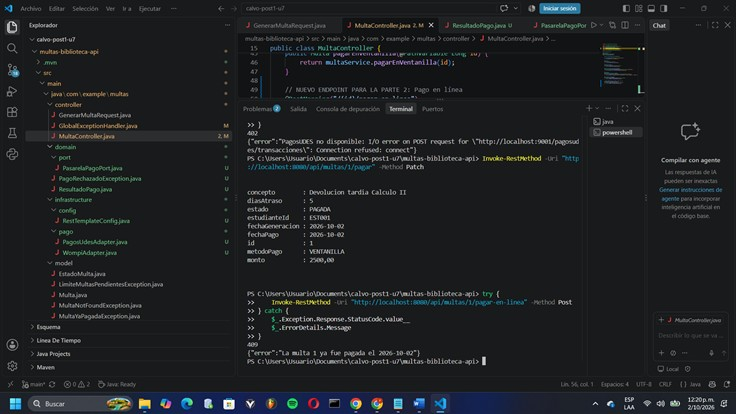

# Post-contenido — Unidad 7: Patrones Arquitectónicos I

## Descripción

Repositorio del post-contenido de la Unidad 7 de Patrones de Diseño de Software. Un único proyecto Spring Boot (`multas-biblioteca-api`) para la gestión de multas de una biblioteca universitaria, con dos partes:

1. **Parte 1:** una API REST con arquitectura en capas (Model, Repository, Service, Controller) sobre H2.
2. **Parte 2:** pago en línea de multas con dos pasarelas intercambiables por configuración (PagosUDES y Wompi), resuelto con un puerto de dominio y dos adaptadores (arquitectura hexagonal aplicada solo a esta porción).

## Parte 1 — Arquitectura en Capas

La API se organiza en cuatro capas con responsabilidades separadas y dependencias en un solo sentido (`controller → service → repository`, y todas hacia `model`):

| Capa | Paquete | Responsabilidad |
|---|---|---|
| Presentación | `controller/` | Expone `/api/multas`, valida la entrada (`@Valid`) y traduce excepciones de negocio a códigos HTTP (`GlobalExceptionHandler`). No accede nunca al Repository: siempre pasa por `MultaService`. |
| Aplicación | `service/` | `MultaService` orquesta los casos de uso y aplica las reglas que requieren datos externos (límite de multas pendientes). No conoce detalles HTTP. |
| Dominio | `model/` | Entidad `Multa`, enum `EstadoMulta` y excepciones de negocio. `Multa` conserva comportamiento propio (`calcularMonto`, `marcarComoPagada`). |
| Infraestructura | `repository/` | `MultaRepository` extiende `JpaRepository` y agrega `countByEstudianteIdAndEstado`, una consulta agregada que evita traer la lista completa a memoria. |

`MultaService` **no es un passthrough** del Repository: en `generar` valida el límite de multas pendientes (consulta + decisión), construye la entidad, calcula el monto con `Multa.calcularMonto` y persiste; en `pagarEnVentanilla` delega a la entidad la transición de estado y su regla (`marcarComoPagada` impide pagar dos veces).

### Endpoints

| Método | Ruta | Descripción | Respuestas |
|---|---|---|---|
| GET | `/api/multas` | Lista todas las multas | 200 |
| GET | `/api/multas/{id}` | Busca una multa | 200 / 404 |
| GET | `/api/multas/estudiante/{estudianteId}` | Multas de un estudiante | 200 |
| POST | `/api/multas` | Genera una multa y calcula su monto | 201 / 400 / 409 |
| PATCH | `/api/multas/{id}/pagar` | Pago en ventanilla (`metodoPago = "VENTANILLA"`) | 200 / 404 / 409 |
| POST | `/api/multas/{id}/pagar-en-linea` | Pago en línea por la pasarela activa (Parte 2) | 200 / 402 / 404 / 409 |


## Parte 2 — Pago en Linea con Dos Pasarelas

**Opción elegida: C — puerto de dominio con dos adaptadores** (arquitectura hexagonal solo en la porción de pago; el resto del proyecto sigue en capas).

- `domain/port/PasarelaPagoPort` y `domain/ResultadoPago` son Java puro, sin imports de Spring ni de ningún cliente HTTP.
- `infrastructure/pago/PagosUdesAdapter` e `infrastructure/pago/WompiAdapter` implementan el puerto y traducen cada formato HTTP externo (`idTransaccion/estadoTransaccion` en pesos vs. `reference/status` en centavos) al mismo `ResultadoPago`.
- Se seleccionan por la propiedad `app.pagos.proveedor` (`pagosudes` o `wompi`) sin tocar `MultaController` ni los métodos existentes de `MultaService`.
- `MultaService.pagarConPasarela` solo conoce el puerto: verifica que la multa no esté pagada, llama a `procesar`, lanza `PagoRechazadoException` (402) si el resultado no es exitoso y, si lo es, marca la multa como pagada con el proveedor como método de pago.

### Estructura final de paquetes

```
calvo-post1-u7/
└── multas-biblioteca-api/
    ├── pom.xml
    └── src/main/
        ├── resources/application.properties
        └── java/com/example/multas/
            ├── controller/                  Parte 1 — Presentación
            │   ├── MultaController.java
            │   └── GlobalExceptionHandler.java
            ├── service/                     Parte 1 — Aplicación
            │   └── MultaService.java        (Parte 2: + PasarelaPagoPort)
            ├── model/                       Parte 1 — Dominio de la API en capas
            │   ├── Multa.java
            │   ├── EstadoMulta.java
            │   └── *Exception.java
            ├── repository/                  Parte 1 — Infraestructura de datos
            │   └── MultaRepository.java
            ├── domain/                      Parte 2 — NUEVO, sin Spring
            │   ├── port/PasarelaPagoPort.java
            │   ├── ResultadoPago.java
            │   └── PagoRechazadoException.java
            ├── infrastructure/              Parte 2 — NUEVO, conoce Spring y HTTP
            │   ├── pago/
            │   │   ├── PagosUdesAdapter.java
            │   │   └── WompiAdapter.java
            │   └── config/RestTemplateConfig.java
            └── MultasApplicationApiApplication.java
```

Dirección de las dependencias en la Parte 2: `MultaService → PasarelaPagoPort ← PagosUdesAdapter / WompiAdapter`. El Service depende de la abstracción y los adaptadores dependen del puerto; el dominio nunca conoce a los adaptadores.

## Cómo ejecutar

```
$ cd multas-biblioteca-api && mvn clean package && mvn spring-boot:run
```

- API: `http://localhost:8080/api/multas`
- Consola H2: `http://localhost:8080/h2-console` (JDBC URL `jdbc:h2:mem:multas_biblioteca_db`, usuario `sa`, sin contraseña)
- Pasarela activa: propiedad `app.pagos.proveedor` en `application.properties` (`pagosudes` por defecto, o `wompi`). Cambiarla requiere reiniciar la aplicación, pero no modificar ni recompilar código.

Ejemplo de prueba (PowerShell):

```powershell
Invoke-WebRequest -Uri "http://localhost:8080/api/multas" -Method Post -ContentType "application/json" `
  -Body '{"estudianteId":"EST001","concepto":"Libro de Calculo","diasAtraso":3}' | Select-Object StatusCode, Content
```


## Herramientas utilizadas

- Java 17, Spring Boot 3.x, Spring Data JPA, H2, RestTemplate
- Apache Maven, PowerShell (`Invoke-RestMethod` / `Invoke-WebRequest`) y curl, Git, GitHub

## Decisiones de diseño

### Punto de decisión 1 — Cálculo del monto: ¿entidad o Service?

**Decisión:** el cálculo del monto vive como método estático en la entidad de dominio: `Multa.calcularMonto(int diasAtraso)`. `MultaService.generar` solo lo invoca (`multa.setMonto(Multa.calcularMonto(diasAtraso))`).

**Criterio usado para decidir "entidad" vs. "Service":** si una regla de negocio no necesita ningún colaborador externo (Repository, otro Service, un bean de Spring) y solo depende de datos que ya posee el objeto o que recibe por parámetro, es una regla que describe *cómo se comporta una Multa* y debe vivir en el objeto de dominio. Si la regla necesita consultar o coordinar otros componentes, describe *cómo se orquesta un caso de uso* y pertenece al Service. El monto cumple lo primero: depende únicamente de `diasAtraso`, `VALOR_POR_DIA` ($500) y `TOPE_MAXIMO` ($15.000).

**Argumentos a favor de la decisión tomada:**
1. **Evita el modelo anémico.** `Multa` conserva comportamiento propio (`calcularMonto`, `marcarComoPagada`) en lugar de ser solo un contenedor de getters y setters.
2. **Única fuente de verdad.** Las constantes y la fórmula están junto al concepto que describen. Cualquier otro punto del sistema que necesite calcular un monto (un reporte, una simulación, un futuro endpoint de "cuánto pagaría") llama a `Multa.calcularMonto` sin duplicar la fórmula ni depender de `MultaService`.
3. **Testeabilidad.** Se puede probar con un test unitario de Java puro (por ejemplo, 1 día → 500; 30 días → 15.000 por el tope), sin levantar el contexto de Spring ni simular un Repository.

**Alternativa descartada:** un método privado `calcularMonto` en `MultaService`. Funcionaría, y tiene una ventaja real: si la tarifa dejara de ser fija y dependiera de datos externos (tarifas por tipo de usuario en base de datos o configuración), el Service sería el lugar natural porque ya tendría colaboradores. Se descartó porque en este caso la regla no necesita ninguno, y ubicarla ahí habría dejado a `Multa` sin comportamiento y obligado a otros componentes a duplicar la fórmula o a pasar por el Service para algo que no requiere dependencias.

**Costo asumido:** al ser estático y con constantes fijas, el valor por día y el tope no son configurables sin recompilar. Si el negocio exigiera tarifas variables, la regla tendría que migrar al Service (o a un componente de política de tarifas).

**Esto no convierte a `MultaService` en un passthrough:** conserva la regla que sí requiere datos externos (límite de multas pendientes) y orquesta el flujo completo de `generar`: validar el límite, construir la entidad, calcular el monto y persistir.

### Punto de decisión 2 — Conteo de multas pendientes: ¿consulta o filtrado en memoria?

**Decisión:** la regla "un estudiante no puede acumular más de 3 multas pendientes" se resuelve con `MultaRepository.countByEstudianteIdAndEstado`, una consulta derivada de Spring Data JPA que se traduce a un `SELECT COUNT(*) ... WHERE estudiante_id = ? AND estado = ?` ejecutado por la base de datos (H2).

**Separación de responsabilidades:** la *decisión de negocio* ("¿se le permite generar una multa más?") la toma exclusivamente `MultaService.generar`, que compara el conteo con `LIMITE_MULTAS_PENDIENTES` y lanza `LimiteMultasPendientesException` (409 Conflict). El *dato* que esa decisión necesita ("¿cuántas tiene pendientes?") se obtiene donde es eficiente resolverlo: en el motor de base de datos. El Repository no decide nada; el Service no sabe cómo se cuenta.

**Argumentos a favor de la decisión tomada:**
1. **Transferencia mínima de datos.** Viaja un solo número, no N entidades completas hidratadas por JPA.
2. **Memoria constante.** No se instancian objetos `Multa` solo para descartarlos tras filtrar.
3. **Escalabilidad del tiempo de respuesta.** La base de datos puede resolver el conteo apoyándose en índices, y el costo no crece con el volumen de datos que atraviesa la aplicación.

**Alternativa descartada:** `findByEstudianteId(...)` seguido de `.stream().filter(m -> m.getEstado() == PENDIENTE).count()`. Tiene a su favor que es más simple de leer, que no exige un método extra en el Repository y que, con pocos datos de prueba, el rendimiento es indistinguible. Se descartó porque es un problema de diseño y no solo de rendimiento: con miles de multas por estudiante, cada creación de multa cargaría todo el historial del estudiante (incluidas las ya pagadas) solo para obtener un número, y el tiempo de respuesta de `POST /api/multas` degradaría proporcionalmente al tamaño del historial. Si esa consulta creciera, el costo se pagaría en cada operación de escritura.

**Costo asumido:** el Repository expone un método más (una consulta derivada adicional) y la regla queda repartida entre dos capas (el dato en infraestructura, la decisión en el Service), lo que exige tener claro quién hace qué.

### Punto de decisión 3 — Selección del adaptador activo

**Decisión:** la selección se resuelve con `@ConditionalOnProperty` sobre la propiedad `app.pagos.proveedor`. `PagosUdesAdapter` se activa con el valor `pagosudes` (también por defecto, con `matchIfMissing = true`) y `WompiAdapter` con el valor `wompi`. Spring solo registra uno de los dos beans en el contexto al arrancar, por lo que `MultaService` pide por constructor un único `PasarelaPagoPort`, sin `@Qualifier` ni lógica condicional propia.

**Argumentos a favor de la decisión tomada:**
1. **`MultaService` no conoce la existencia de proveedores.** No maneja claves de configuración ni nombres de pasarelas; solo depende de la interfaz. Cambiar `app.pagos.proveedor` de `pagosudes` a `wompi` no requiere tocar ni recompilar `MultaController` ni `MultaService`.
2. **Calza con el requisito real.** Cada campus usa una pasarela fija durante el piloto, así que la selección una sola vez al arranque es suficiente.
3. **Falla rápido ante errores de configuración.** Si la propiedad tiene un valor no soportado, no existe ningún bean `PasarelaPagoPort` y la aplicación no arranca (`NoSuchBeanDefinitionException`). El error aparece al desplegar, no cuando un estudiante intenta pagar.
4. **Agregar una tercera pasarela es aditivo.** Basta con crear un nuevo adaptador con su propio `havingValue`; no se modifica código existente.

**Alternativa descartada:** inyectar un `Map<String, PasarelaPagoPort>` y elegir la clave en tiempo de ejecución dentro de `MultaService`.

- **Lo que tenía a su favor:** da más flexibilidad. Permite cambiar de proveedor sin reiniciar la aplicación, elegir pasarela por transacción y hacer fallback automático si una pasarela cae.
- **Por qué se descartó:** el requisito no pide ninguna de esas capacidades (una pasarela fija por sede durante el piloto), y habría obligado a `MultaService` a conocer las claves de configuración de cada proveedor, es decir, a filtrar un detalle de infraestructura hacia la capa de aplicación.

**Costo asumido:** cambiar de pasarela exige **reiniciar la aplicación**. No es posible alternar en caliente ni usar una pasarela de respaldo si la activa falla. Si el negocio pidiera eso después de terminado el piloto, habría que migrar al enfoque de `Map` (o a una fábrica de pasarelas), y ese cambio sí tocaría `MultaService`.

### Punto de decisión 4 — Diseño del puerto y el tipo de resultado

**Decisión:** `PasarelaPagoPort.procesar(Multa)` devuelve siempre el mismo tipo de dominio, `ResultadoPago(proveedor, exitoso, referenciaExterna, mensaje)`. Cada adaptador absorbe el contrato HTTP de su pasarela y lo traduce a ese tipo antes de devolverlo:

| | PagosUDES | Wompi |
|---|---|---|
| Identificador | `idTransaccion` | `reference` |
| Estado | `estadoTransaccion` (`"APROBADA"`) | `status` (`"APPROVED"`) |
| Monto | pesos (`BigDecimal`) | centavos (`long`) |
| Se traduce a | `referenciaExterna`, `exitoso` | `referenciaExterna`, `exitoso` |

La conversión a centavos y la interpretación de `"APROBADA"` / `"APPROVED"` quedan encerradas en cada adaptador. Los DTOs de cada pasarela (`PagosUdesRequest`, `WompiResponse`, etc.) son registros privados dentro del adaptador y nunca salen de `infrastructure/`.

**Argumentos a favor de la decisión tomada:**
1. **`MultaService` queda ciego a los proveedores.** `pagarConPasarela` solo consulta `resultado.exitoso()` y `resultado.mensaje()`; no distingue formatos ni nombres de campos.
2. **Una tercera pasarela no toca el Service.** Agregarla es crear un adaptador que traduzca su formato a `ResultadoPago`. Con la alternativa, además habría que modificar `MultaService`.
3. **El dominio se mantiene sin dependencias externas.** `ResultadoPago` es un `record` de Java puro; `domain/` no importa Spring ni ningún cliente HTTP.
4. **Testeabilidad.** `MultaService` se prueba con un `PasarelaPagoPort` simulado que devuelve un `ResultadoPago` fijo, sin servidor HTTP.

**Alternativas descartadas:**
- *Que el puerto devolviera el DTO propio de cada pasarela.* Tenía a su favor menos código, porque no habría traducción. Se descartó porque `MultaService` tendría que conocer ambos formatos (`estadoTransaccion` vs. `status`, pesos vs. centavos) y razonar sobre cada uno, con lo que las diferencias de infraestructura volverían a filtrarse hacia la lógica de negocio.
- *Que el puerto tuviera dos métodos, uno por proveedor.* Obliga a modificar la interfaz y todos los adaptadores cada vez que se agrega o se quita una pasarela, y el Service tendría que decidir cuál método invocar.

**Qué se rompería si `ResultadoPago` tuviera `idTransaccion` en vez de `referenciaExterna`:** el nombre `idTransaccion` es el vocabulario propio de PagosUDES. Wompi no devuelve un `idTransaccion`, devuelve un `reference` (en este laboratorio, el valor `"multa-<id>"` que el propio sistema envía). Con ese nombre, `WompiAdapter` tendría que inventar un valor o rellenar un campo cuyo nombre no describe lo que Wompi realmente entrega. Eso indicaría que el tipo de dominio quedó acoplado al proveedor actual y dejó de ser neutral. Un nombre como `referenciaExterna` describe lo que ambas pasarelas aportan: la referencia con la que el proveedor identifica la operación.

**Costo asumido:** el diseño obliga a escribir una capa de traducción por proveedor y un tipo de dominio adicional. Además, `ResultadoPago` solo contiene el denominador común de ambas pasarelas: si en el futuro se necesitara un dato exclusivo de una de ellas (por ejemplo, el código de autorización de Wompi), habría que ampliar el tipo de dominio de forma que siga siendo neutral.

### Trade-off considerado — Parte 2

Frente al requisito de las dos pasarelas se evaluaron tres opciones: **A** (rama `if/switch` en `MultaService`), **B** (interfaz Strategy dentro de `service/`) y **C** (puerto de dominio con dos adaptadores). Se eligió **C**, y la alternativa descartada más cercana fue **B**, porque también resuelve la intercambiabilidad sin salir de la arquitectura en capas.

**Por qué no A:** `MultaService` pasaría a conocer los detalles HTTP de ambas pasarelas (URLs, formatos `idTransaccion/estadoTransaccion` vs. `reference/status`, conversión a centavos). Es la opción más rápida de escribir, pero cada pasarela nueva o retirada obligaría a modificar un servicio ya probado, y la lógica de negocio quedaría mezclada con detalles de integración.

**Por qué no B:** una interfaz `PasarelaPago` en `service/` evita ese acoplamiento y habría costado menos paquetes. Tiene a su favor la simplicidad y que sigue siendo "capas puras". Se descartó porque deja la traducción de contratos externos (y sus clientes HTTP, con `RestTemplate`) dentro de la capa de aplicación, que debería ocuparse de orquestar casos de uso. Con el puerto, esa traducción queda en `infrastructure/` y la capa de aplicación solo conoce un tipo de dominio neutral (`ResultadoPago`).

**Qué se ganó con C:**
- `MultaService` no conoce ni los formatos ni los nombres de las pasarelas.
- Cambiar de pasarela es un cambio de configuración, y agregar o quitar una es aditivo: un adaptador nuevo, sin modificar el Service ni el Controller.
- `domain/` queda libre de Spring y de clientes HTTP, y el Service es testeable con un puerto simulado.

**Qué costó adicionalmente:**
- Dos paquetes nuevos (`domain/` e `infrastructure/`) y seis clases/archivos adicionales (puerto, `ResultadoPago`, `PagoRechazadoException`, dos adaptadores, `RestTemplateConfig` y la configuración), frente a una sola interfaz y dos clases con la opción B.
- Una capa de traducción por proveedor y un tipo de dominio extra que hay que mantener neutral.
- Más curva de aprendizaje: el equipo debe entender la dirección de las dependencias (`Service → Puerto ← Adaptador`) y por qué existen `domain/` y `model/` a la vez.
- Una pureza solo parcial: `PasarelaPagoPort.procesar(Multa)` recibe la entidad `Multa`, que vive en `model/` y lleva anotaciones JPA. El puerto no importa Spring, pero depende de una entidad persistente; un hexagonal estricto habría usado un tipo de dominio sin anotaciones de persistencia. Se aceptó para no migrar `Multa` a hexagonal, lo cual se consideró sobre-ingeniería para este alcance.

**¿Se revertiría si el piloto terminara y solo quedara una pasarela?** No de inmediato. Si quedara una sola y no se esperaran más, el puerto sería más estructura de la necesaria, y una opción razonable sería simplificar a una clase concreta en `service/` o `infrastructure/` (sin el adaptador alternativo ni `@ConditionalOnProperty`). Aun así, el costo de mantener el puerto es bajo (una interfaz y un adaptador), y conserva el aislamiento del contrato HTTP y la testeabilidad del Service. Se revisaría la decisión únicamente si el mantenimiento de la capa de traducción superara el beneficio en la práctica.

## Conclusiones

Las dos partes mostraron que la ubicación de cada regla depende de qué necesita para ejecutarse: lo que solo usa sus propios datos (el monto) vive en la entidad, y lo que requiere datos externos (conteo de multas pendientes) se resuelve en la infraestructura y se decide en el Service. En la Parte 2, el puerto con adaptadores aísló los contratos HTTP de las pasarelas, de modo que el Service no cambia aunque cambien los proveedores. Lo más difícil de decidir entre extender las capas o introducir el puerto fue que la opción B también resolvía la intercambiabilidad con menos código; lo que inclinó la balanza fue que cada pasarela tiene un contrato HTTP distinto y que el número de proveedores es previsiblemente cambiante. También aprendimos que aplicar hexagonal solo a una porción es una decisión de proporcionalidad: se paga complejidad donde existe una tensión real, no en todo el proyecto. Finalmente, probar los checkpoints permitió detectar errores en el código de la guía (`>` en lugar de `>=` y `=` en lugar de `==`) que habrían roto el comportamiento esperado.

### Evidencia de endpoints probados

| Checkpoint | Resultado esperado | Captura |
|---|---|---|
| `GET /api/multas` al iniciar | 200 con lista vacía |  |
| `POST /api/multas` válido | 201 con monto calculado  |  |
| `POST /api/multas` sin `estudianteId` | 400 con mensaje de validación |  |
| Cuarta multa pendiente del mismo estudiante | 409 Conflict |  |
| `GET /api/multas/999` | 404 Not Found |  |
| `PATCH /api/multas/{id}/pagar` y repetirlo | 200 `PAGADA`/`VENTANILLA`; segundo intento 409 |  |
| Pago en línea con `pagosudes` | Usa `PagosUdesAdapter` |  |
| Pago en línea con `wompi` (sin tocar código)-Pago rechazado por la pasarela | Usa `WompiAdapter` -402 con el mensaje del proveedor |  |
| Pagar una multa ya pagada | 409 Conflict (ventanilla y en línea) |  |
